**Program:**

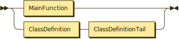

```
Program  ::= MainFunction
           | ClassDefinition ClassDefinitionTail
```

**ClassDefinitionTail:**

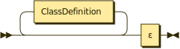

```
ClassDefinitionTail
         ::= ClassDefinition* ε
```

referenced by:

* Program

**Assignment:**

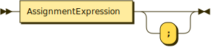

```
Assignment
         ::= AssignmentExpression ';'?
```

referenced by:

* ForLoop

**AssignmentExpression:**

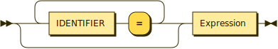

```
AssignmentExpression
         ::= ( IDENTIFIER '=' )* Expression
```

referenced by:

* Assignment

**Expression:**

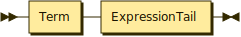

```
Expression
         ::= Term ExpressionTail
```

referenced by:

* AssignmentExpression
* BooleanExpression
* Factor
* PrintArgs

**ExpressionTail:**


```
ExpressionTail
         ::= ( ( '+' | '-' ) Term )* ε
```

referenced by:

* Expression

**Term:**


```
Term     ::= Factor TermTail
```

referenced by:

* Expression
* ExpressionTail

**TermTail:**


```
TermTail ::= ( ( '*' | '/' ) Factor )* ε
```

referenced by:

* Term

**Factor:**

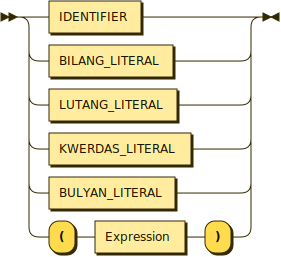

```
Factor   ::= IDENTIFIER
           | BILANG_LITERAL
           | LUTANG_LITERAL
           | KWERDAS_LITERAL
           | BULYAN_LITERAL
           | '(' Expression ')'
```

referenced by:

* Term
* TermTail

**Conditional:**

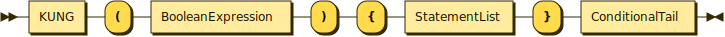

```
Conditional
         ::= KUNG '(' BooleanExpression ')' '{' StatementList '}' ConditionalTail
```

**ConditionalTail:**

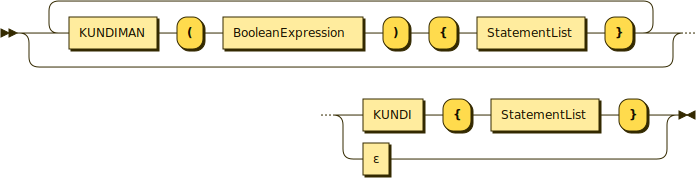

```
ConditionalTail
         ::= ( KUNDIMAN '(' BooleanExpression ')' '{' StatementList '}' )* ( KUNDI '{' StatementList '}' | ε )
```

referenced by:

* Conditional

**BooleanExpression:**

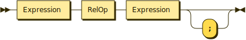

```
BooleanExpression
         ::= Expression RelOp Expression ';'?
```

referenced by:

* Conditional
* ConditionalTail
* DoWhileLoop
* ForLoop
* WhileLoop

**RelOp:**

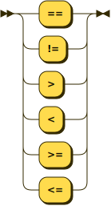

```
RelOp    ::= '=='
           | '!='
           | '>'
           | '<'
           | '>='
           | '<='
```

referenced by:

* BooleanExpression

**Iterative:**

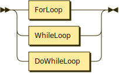

```
Iterative
         ::= ForLoop
           | WhileLoop
           | DoWhileLoop
```

**ForLoop:**

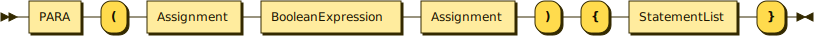

```
ForLoop  ::= PARA '(' Assignment BooleanExpression Assignment ')' '{' StatementList '}'
```

referenced by:

* Iterative

**WhileLoop:**

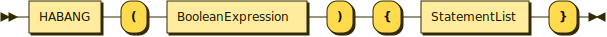

```
WhileLoop
         ::= HABANG '(' BooleanExpression ')' '{' StatementList '}'
```

referenced by:

* Iterative

**DoWhileLoop:**

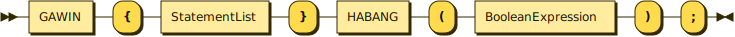

```
DoWhileLoop
         ::= GAWIN '{' StatementList '}' HABANG '(' BooleanExpression ')' ';'
```

referenced by:

* Iterative

**ClassDefinition:**

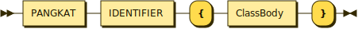

```
ClassDefinition
         ::= PANGKAT IDENTIFIER '{' ClassBody '}'
```

referenced by:

* ClassDefinitionTail
* Program

**ClassBody:**

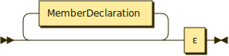

```
ClassBody
         ::= MemberDeclaration* ε
```

referenced by:

* ClassDefinition

**MemberDeclaration:**

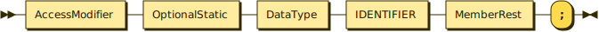

```
MemberDeclaration
         ::= AccessModifier OptionalStatic DataType IDENTIFIER MemberRest ';'
```

referenced by:

* ClassBody

**AccessModifier:**

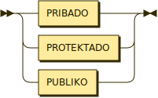

```
AccessModifier
         ::= PRIBADO
           | PROTEKTADO
           | PUBLIKO
```

referenced by:

* MemberDeclaration

**OptionalStatic:**

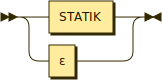

```
OptionalStatic
         ::= STATIK
           | ε
```

referenced by:

* MemberDeclaration

**MemberRest:**

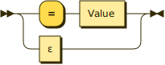

```
MemberRest
         ::= '=' Value
           | ε
```

referenced by:

* MemberDeclaration

**Value:**

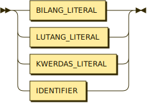

```
Value    ::= BILANG_LITERAL
           | LUTANG_LITERAL
           | KWERDAS_LITERAL
           | IDENTIFIER
```

referenced by:

* MemberRest

**Print:**

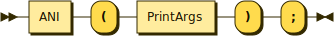

```
Print    ::= ANI '(' PrintArgs ')' ';'
```

**PrintArgs:**


```
PrintArgs
         ::= Expression ( ',' Expression )*
```

referenced by:

* Print

**Scan:**

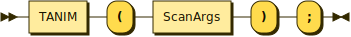

```
Scan     ::= TANIM '(' ScanArgs ')' ';'
```

**ScanArgs:**


```
ScanArgs ::= IDENTIFIER ( ',' IDENTIFIER )*
```

referenced by:

* Scan

## 
 <sup>generated by [RR - Railroad Diagram Generator][RR]</sup>

[RR]: https://www.bottlecaps.de/rr/ui